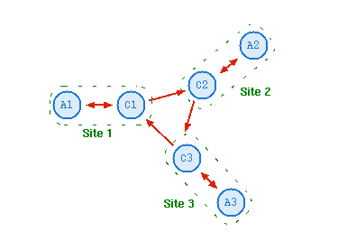
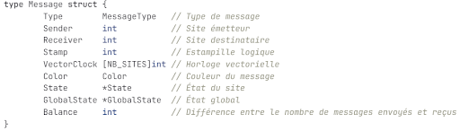
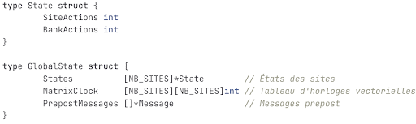
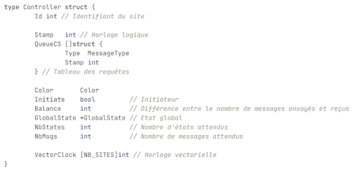
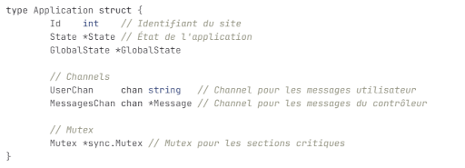

# Rapport de projet SR05 - Systèmes Répartis

## Contexte

Le programme consiste en une application qui va simuler la gestion d'un stock d'actions par une banque, lié à différents clients qui vont chercher à acheter ou vendre l'action en question. Il n'y a donc qu'un seul type d'actions qui est concerné, et le stock de cette action disponible à la banque est la variable qui est partagée à travers les sites.

Nous avons donc au cours du déroulement de notre application fait attention à l'évolution du solde d'actions auprès de la banque. Nous avons mis en place **une exclusion mutuelle** pour qu'un seul site puisse acheter et vendre des actions en même temps, afin de ne pas arriver à des situations incohérentes où l'on se retrouve avec un nombre d'actions négatif auprès de la banque. À ce stade, **le système est fermé**, c'est-à-dire que le nombre de clients n'est pas dynamique et sera défini au lancement de l'application. Il n'y a donc pas de nouveaux clients qui peuvent arriver en cours de route.

## Utilisation de l'application

Pour pouvoir lancer l'application, ouvrez un terminal **en vous situant à la racine du dossier**. Avant toutes choses, vérifiez que les scripts présents dans le répertoire `scripts` aient tous le droit d'exécution (`chmod +x` si ce n'est pas le cas). De plus, l'application nécessite le paquet `xterm`, présent dans les distributions Linux (installable avec la commande `sudo apt install xterm`), ainsi que, cela va de soi, l'installation de golang.

**Une fois cela fait, exécutez la commande suivante : `./scripts/v2/runner.sh 3`.**

Le nombre de sites (par défaut 3) correspond à celui défini dans la variable `NB_SITES` du fichier `utils/misc.go`.

Ensuite, il y aura 6 terminaux `xterm` qui vont s'ouvrir. Chaque terminal possède un titre qui sera soit `Application ID`, ou `Controleur ID`. `ID` va représenter l'identifiant d'un site. Une application et un contrôleur avec les mêmes identifiants sont liés entre eux. L'utilisateur va être amené à interagir avec les terminaux se nommant *Application*. Les contrôleurs ne sont là que dans un but informatif pour donner un aperçu sur les messages traversant le système.

Il retrouvera dans les applications un menu à choix, dont les fonctionnalités sont présentées plus bas dans la partie *Fonctionnalités* de `app.go`.

Pour fermer l'application et tous ses terminaux, l'utilisateur se rend dans le terminal avec lequel il a lancé la première commande, et entre la combinaison de touches `Ctrl+C`.

## Architecture et fonctionnement

Pour simuler un système réparti réaliste, nous avons utilisé **un anneau unidirectionnel avec une application de contrôle** (la *Structure numéro 7 de l'Étape 3 du projet*). Pour rappel, voici un schéma de l'architecture nommée, provenant du moodle de SR05 :

Les trois sites ici présents seront ceux de notre programme. Les ID iront dans notre cas de 0 à 2, et seront disponibles en haut des fenêtres.

Vous trouverez ci-dessous une présentation succincte de ce que réalise chacun des programmes développés pour notre application.

### `ctl.go`

#### Description

Ce programme va représenter **le contrôleur d'un site du système réparti**. Celui-ci est lié à un site et schématisé par la lettre C sur le schéma ci-dessus.

On retrouve dans ce programme une fonction `main()` :

- Tout d'abord, elle initialise le contrôleur à l'aide d'un appel à `NewController()` et attribue les valeurs initiales d'action au site.
- La fonction `NewController()`, qui prend en paramètre l'id du site, va initialiser le contrôleur avec les valeurs par défaut.
- Ensuite, le programme entre dans une boucle infinie qui est chargée de lire l'entrée standard du processus qui a lancé l'exécutable `ctl`.
- Pour cela, il va utiliser la fonction `ReceiveMessage()` du paquet utils, qui va parser le message à l'aide d'autres fonctions présentes dans le paquet. Le *parsing* va permettre de récupérer le destinataire du message, si le destinataire correspond à l'id du contrôleur, alors il traite le message. S'il n'est pas le destinataire du message, il renvoie le message sur l'anneau et le message tourne jusqu'à rencontrer le site prévu.
- Tout au long de cette boucle, le contrôleur va incrémenter et mettre à jour l'horloge logique avec la fonction `horlogeLogique()`, qui prend en argument un message. La fonction `horlogeLogique()` compare les estampilles et le vecteur d'horloge logique du message avec ceux du site, et récupère le max en incrémentant de 1.
- À chaque message reçu, le contrôleur fait également un appel à `constructionInstantane()`, qui prend en argument un message. La fonction est chargée de mettre en place la version finale de l'algorithme d'instantané vu en cours, soit l'*Algorithme 11 du Chapitre 6*.
- Il est nécessaire de faire appel à cette fonction à chaque fois car il faut vérifier l'envoi de message par des sites de couleur rouge.
- La réinitialisation à un instantané précédent demandée par l'application est également gérée au sein de cet algorithme, on récupère la demande qu'on transmet aux autres contrôleurs. À la réception de ce message, chaque contrôleur va transmettre cette demande aux applications avec le type `ACTUALISATION_INSTANTANE`.
- Enfin, le contrôleur lance également la fonction `fileAttenteRepartie()`, qui prend en argument le message reçu, et qui sert à mettre en place l'algorithme de file d'attente répartie. Cet algorithme utilise les estampilles et permet de coordonner l'accès à une section critique partagée entre plusieurs applications réparties. Chaque application utilise des messages pour demander l'accès à la section critique, libérer cette section une fois qu'elle a terminé son traitement, et informer les autres applications de sa disponibilité ou de la fin de son utilisation de la section critique.

#### Fonctionnalités

Le programme `ctl.go` permet l'implémentation des fonctionnalités suivantes, qui permettent le fonctionnement de l'application :

**Algorithme File d'attente Répartie :**

- Demande d'accès à la section critique (`DEMANDE_SC`)
- Libération de la section critique (`FIN_SC`)
- Réception des demandes d'accès des autres applications (`REQUETE`)
- Réception des libérations des autres applications (`LIBERATION`)
- Transmission des accusés de réception (`ACCUSE`)
- Gestion des messages inconnus et transmission à l'application de base

**Algorithme instantané :**

- Gestion des demandes de sauvegarde
- Gestion des messages de type `ETAT`
- Gestion des messages de type `PREPOST`
- Propagation des instantanés
- Retour au dernier instantané (`REVERT_INSTANTANE_APP` et `REVERT_INSTANTANE_CTL`)

### `app.go`

#### Description

Ce programme va représenter **l'application d'un site du système réparti**, schématisée par la lettre A sur le schéma ci-dessus.

Le programme a le fonctionnement suivant :

- Il fait un appel à `NewApplication()`, qui prend en arguments l'id du site, les stocks d'actions présents sur le site et à la banque (qui ont les valeurs par défaut 20 et 100 respectivement).
- Cette fonction va retourner un pointeur de type `Application`, qui contient l'id de l'application, l'état initial et deux canaux, qui vont permettre de traiter les messages envoyés par le contrôleur, ainsi que ceux de l'utilisateur. Enfin, on y intègre le mutex utilisé pour l'exclusivité.
- Une fois l'application initialisée, elle va traiter à l'infini les messages qui vont arriver sur l'entrée standard, via la goroutine `handleMessage()`. Celle-ci est reliée à une application et va permettre d'interagir avec l'utilisateur.  
  La goroutine permet d'afficher un menu qui permet de consulter le nombre d'actions disponibles sur le site et à la banque, d'acheter des actions à la banque ou de vendre des actions que le site possède. L'accès à la banque pour l'achat ou la vente d'actions est géré par l'algorithme de file d'attente répartie de `clt.go`. De plus, le menu permet d'effectuer une sauvegarde des instantanés, qui va faire appel à l'algorithme de construction d'instantanés du contrôleur. On peut également demander une réinitialisation des actions pour revenir au dernier instantané sauvegardé.  
  Elle utilise les fonctions du paquet `utils`, pour créer et envoyer les messages, en mettant en paramètre les attributs de la structure `Message` qui est définie plus bas.
- Pour permettre un affichage permettant de différencier les types de messages, nous avons développé le paquet `display`, qui permet de faire des affichages colorés dans `xterm`.
- L'application ne peut envoyer des messages qu'à son contrôleur. Si elle veut envoyer un message au contrôleur, elle met l'attribut `receiver` à `id` (l'id de l'application).  
  Si elle veut envoyer un message à un autre site, elle envoie au contrôleur un message avec un `receiver` différent de `id`. Le contrôleur va derrière émettre le message dans l'anneau pour le transmettre au bon site.
- En parallèle de la goroutine `handleMessage()`, le programme lance une goroutine nommée `readMessage()`, qui est, elle aussi, reliée à l'objet de type `Application`. Cette fonction récupère les deux canaux de communication et permet à l'application d'interagir avec son contrôleur ou avec l'utilisateur.
- Nous avons séparé ces deux types de transmission d'information pour faciliter le traitement. Ainsi, une entrée utilisateur est facilement reconnaissable, via l'utilisation de la fonction `ParseMessage()` du paquet `utils`, puisqu'une entrée utilisateur ne peut pas être parsée. Cela nous permet derrière de réaliser le traitement adéquat : soit de lire directement l'entrée utilisateur, soit de faire un appel à la fonction `readControllerMessage()` dans le cas d'un message du contrôleur.
- La fonction `readControllerMessage()` est chargée de récupérer les informations qui sont standardisées dans des chaînes de caractères de type Message. Son rôle est de traiter les messages potentiels que l'application peut recevoir du contrôleur, à savoir :
  - `DEBUT_SC` : lorsque le contrôleur accord une demande de section critique.
  - `ACTUALISATION` : lorsque le stock d'action à la banque a été mis à jour par une autre application.
  - - `ACTUALISATION_GLOBAL_STATE` : lorsqu'une demande d'instantané d'une autre application est finie, le déroulement de l'algorithme fait que les applications de tous les sites doivent stocker le nouvel état global sauvegardé. C'est ce message qui le permettra, via une transmission du contrôleur.
  - - `ACTUALISATION_INSTANTANE` : Ce message est reçu lorsqu'une réinitialisation d'instantané à un état antérieur a été demandé. L'application va modifier ces valeurs locales pour les faire correspondre avec les valeurs sauvegardées précédemment.

#### Fonctionnalités

Le fichier `app.go` permet d'apporter les fonctionnalités suivantes :

- Affichage de l'état du compte personnel
- Affichage du nombre d'actions disponibles à la banque
- Achat d'actions
- Vente d'actions
- Gestion des sections critiques pour l'accès à la banque
- Sauvegarde d'états globaux (demande d'instantané)
- Affichage du dernier instantané
- Reverse des états vers le dernier instantané

### Paquet `utils`

On utilise les programmes du dossier `utils` comme un paquet, qu'on peut inclure dans les programmes utilisés pour notre application. On y retrouve l'ensemble des fonctions utiles dans l'exécution du programme. Ces fonctions sont communes aux sites tout comme aux contrôleurs. On y retrouve notamment nos structures, présentées plus bas, ainsi que toutes les fonctions permettant de parser et de transmettre des messages entre sites et contrôleurs. On retrouve six fichiers qui séparent les fonctions par catégories.

### Paquet `display`

Ce paquet permet de gérer les affichages dans les terminaux utilisés pour l'application. Il nous permet notamment de faciliter grandement les opérations de débogage, en permettant l'affichage de message via plusieurs couleurs pour pouvoir filtrer ce qui est important ou non.

### `./scripts/v2/runner.sh`

**Attention, ce script est à lancer depuis la racine du projet avec la commande `./scripts/v2/runner.sh 3`.**

Il s'agit du script qui va être chargé de la mise en place du réseau. Il va pour cela lancer différents terminaux `xterm` et attendre une entrée utilisateur annonçant la fin de son exécution. Lorsque celle-ci arrive, il est chargé du nettoyage du réseau afin de ne pas laisser de processus ou de fichiers inutiles sur la machine.

Ce script fait appel à d'autres scripts présents dans le même répertoire qui ne sont pas détaillés ici, mais qui ont été programmés dans le même but.

## Structures de données

Pour permettre la simulation du système répartie, nous avons utilisé divers éléments au sein de notre programme.

Premièrement, pour permettre l'agrégation des informations et en faciliter leur décodage une fois qu'elles sont reçues, nous avons mis en place la structure `Message` suivante :

Les attributs utilisés sont détaillés dans les commentaires.

**`MessageType`** va prendre en compte l'ensemble des types de messages présents dans l'algorithme de file répartie du cours, des messages d'actualisation, pour répliquer les données, ainsi que les messages nécessaires à la construction d'instantanés, à savoir : `DEMANDE_SC`, `FIN_SC`, `DEBUT_SC`, `LIBERATION`, `ACCUSE`, `REQUETE`, `DEMANDE_SNAPSHOT`, `FIN_SNAPSHOT`, `ETAT`, `PREPOST`, `SIGNAL_SNAPSHOT`.

Ces constantes vont définir les différents types de messages qui vont voyager au sein de l'application, et sont la base du fonctionnement de tout le système.

On retrouvera également, dans la structure `Message`, les id des sites qui envoient et reçoivent le message, le second permettant de savoir si un message doit être traité ou non par un contrôleur donné.

De plus, on retrouve entre autres les informations nécessaires à la gestion des instantanés avec l'horloge vectorielle, mais aussi l'état de site et l'état global.

`State` permet de stocker **le stock d'actions disponibles sur un site et à la banque**, du point de vue du site. `GlobalState` permet de stocker les états pour chaque site de l'application, ainsi que chaque horloge vectorielle, et les messages prépost, qui sont à sauvegarder dans le cadre de la construction d'un instantané pour qu'il soit cohérent, comme vu dans le cours. Enfin, l'attribut `Color` est utilisé et sert à l'implémentation de l'algorithme de construction d'instantané vu en cours.

Pour pouvoir mettre en place l'exclusion mutuelle, nous avons repris le concept de l'activité 4 avec **l'utilisation d'un mutex**, qui va permettre d'assurer à un site qu'il est le seul à pouvoir interagir avec le stock d'actions disponible à la banque à un instant donné.

Nous avons également utilisé deux structures pour représenter nos contrôleurs et nos applications.

La structure `Controller` est défini comme suit :

On y retrouve l'identifiant du site auquel appartient le contrôleur, ainsi que tous les éléments qui sont nécessaires au fonctionnement des algorithmes.

`QueueCS` contient les requêtes reçues par le contrôleur et qui ne sont pas encore traitées. `Color`, `Initiate`, `NbStates`, `NbMsgs` sont des attributs qui concernent les demandes d'instantanés. Enfin, les derniers attributs sont retrouvés dans la structure `Message`.

Pour ce qui est de la structure application, nous l'avons représenté de la façon suivante :

On y retrouve l'identifiant du site auquel l'application appartient. De plus, nous avons également ajouté les attributs `State` et `GlobalState`, qui contiennent respectivement l'état du site ainsi que ceux de tous les sites actifs. Enfin, on retrouve les attributs nécessaires au fonctionnement de l'application, à savoir les deux canaux de communication et le mutex.
